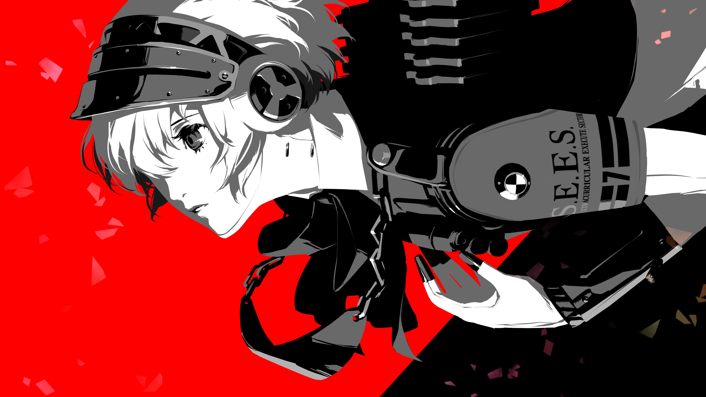

# 🖼️ Wallpaper Vault

A stunning collection of high-quality wallpapers, curated with taste. From abstract minimalism to vibrant landscapes — find the perfect vibe for your desktop.

## 🔍 Categories

- `minimal` – Clean, distraction-free setups
- `anime` – Handpicked anime-style wallpapers
- `tech` – Futuristic and code-themed designs
- `nature` – Landscapes, skies, forests, and more

## 📥 How to Use

1. Clone the repo:

```
git clone https://github.com/roshan6022/wallpaper-vault.git
```

2. Browse the folders and pick your favorite.
3. Set it as your wallpaper and flex.

## 📦 Download Specific Folder

Want only a particular folder? You can do that without cloning the entire repo.

### 💻 GitHub CLI Method

```
gh repo clone roshan6022/wallpaper-vault -- --depth=1 --filter=blob:none --sparse
cd wallpaper-vault
git sparse-checkout set anime/
```

Replace anime/ with any folder you want (like nature/, minimal/, etc.).

## 🌐 Or Use the Web (No CLI Needed)

1. Go to https://downgit.github.io

2. Paste the folder link, e.g.
   https://github.com/roshan6022/wallpaper-vault/tree/main/anime

3. Hit Download

## 🎨 Contribution Guide

Want to add your own wallpaper?

- Preferred resolution: 1920x1080 or higher

- Avoid low-quality or watermarked images

- Place it in the appropriate category folder

Then:

```
git add .
git commit -m "Add: sunset-lake wallpaper to nature"
git push
```

Open a pull request and you're good to go! 🙌

## 📸 Preview

<p align="center">  </p>

## 🧠 License

Wallpapers belong to their respective creators unless stated otherwise. This repo is for personal use and inspiration. If you're the original artist and want your work credited or removed, open an issue or contact me directly.
